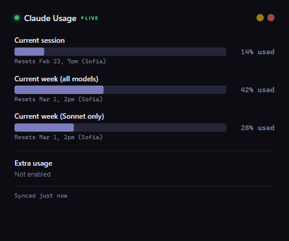

# Claude Usage Widget

A desktop widget that shows your **real-time Claude Pro/Max subscription usage** — session limits, weekly limits, and Sonnet-specific limits — pulled directly from the Anthropic API.



## Features

- **Real usage data** from the Anthropic API (not estimates)
- **Global hotkey** (Ctrl+\\) to toggle the widget
- **System tray** icon with usage tooltip
- **Auto-refreshes** every 60s when visible, every 5 min in background
- **Activity-aware** — refreshes when Claude Code writes to session files
- **Remembers** window size and position
- **Zero cost** — reads the usage endpoint directly, no messages consumed
- **Single instance** — won't open duplicates

## Requirements

- **Claude Code** installed and logged in (the app reads your OAuth token from `~/.claude/.credentials.json`)
- A **Claude Pro or Max** subscription

## Install

### Download

Grab the latest release for your platform from [Releases](../../releases):

- **Windows**: `.exe` installer
- **macOS**: `.dmg`
- **Linux**: `.AppImage`

### From source

```bash
git clone https://github.com/USER/claude-usage-widget.git
cd claude-usage-widget
npm install
npm start
```

## Usage

1. Launch the app — it starts hidden in the system tray
2. Press **Ctrl+\\** to show/hide the widget
3. Click the tray icon to toggle, or right-click for options
4. Enable "Start on Login" from the tray menu to auto-start on boot

## How it works

The widget reads your Claude Code OAuth token from `~/.claude/.credentials.json` and calls the Anthropic usage API endpoint (`/api/oauth/usage`) to fetch your current utilization percentages. No data is sent anywhere except `api.anthropic.com`.

The app is fully open source — inspect the code to verify.

## Building

```bash
npm run build        # Build for current platform
npm run build:win    # Windows .exe
npm run build:mac    # macOS .dmg
npm run build:linux  # Linux .AppImage
```

## Releasing

Push a version tag to trigger the CI build:

```bash
git tag v1.0.0
git push origin v1.0.0
```

GitHub Actions will build for all platforms and create a release.

## License

MIT
